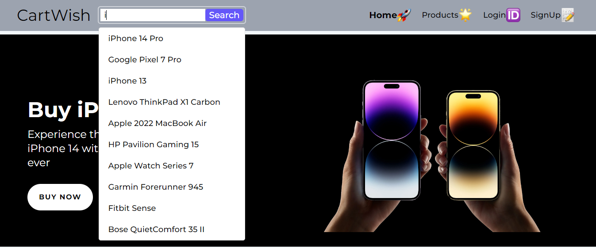
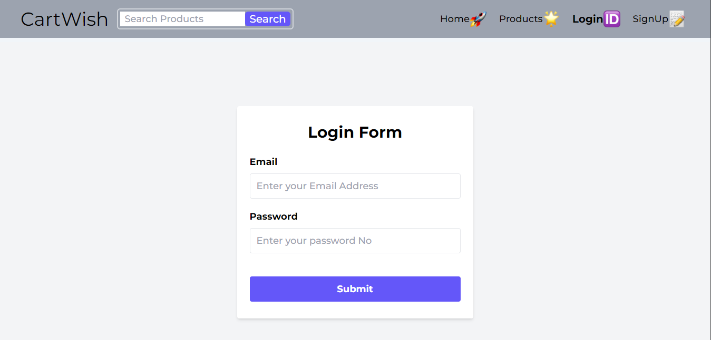
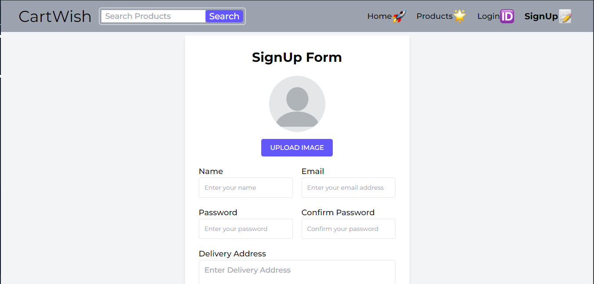
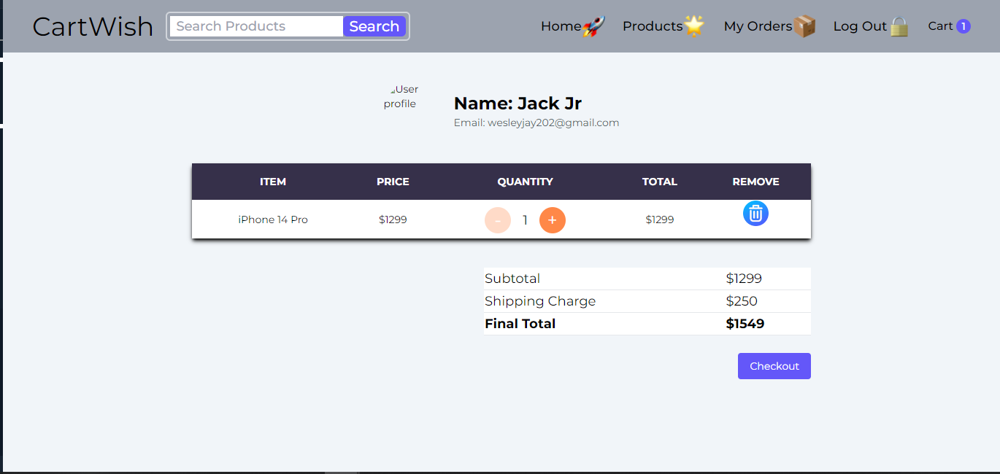
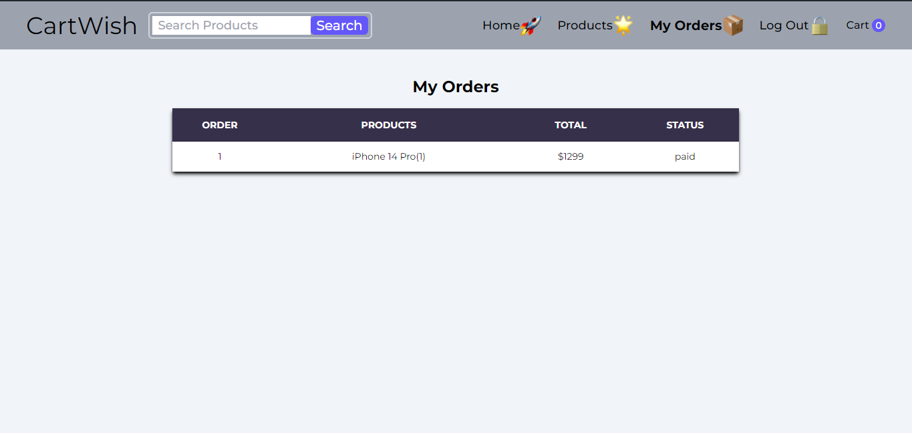
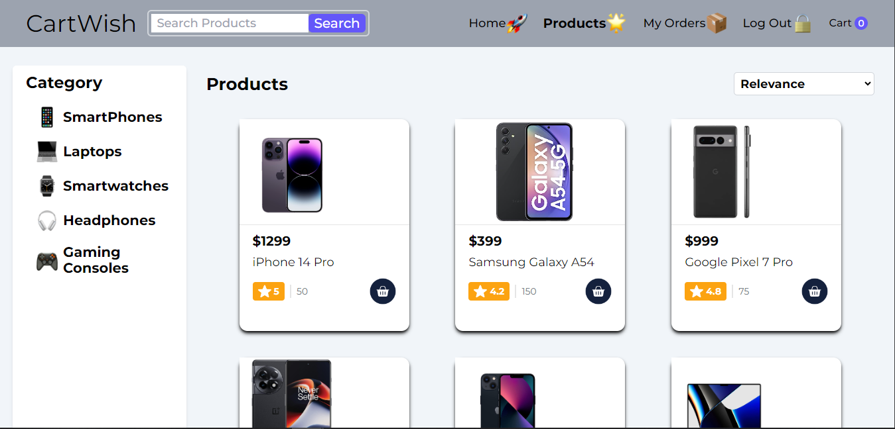

# CartWish Frontend

## Overview

**CartWish** is a dynamic and responsive e-commerce platform designed to provide users with a seamless shopping experience. This repository houses the frontend codebase for CartWish, built using React and Tailwind CSS, with integration into a robust backend API. The platform allows users to browse products, manage their shopping cart, and place orders in a user-friendly interface.

## Screens
<!-- 




 -->
<div style="display: flex; justify-content: space-between;">
  
  
  
  
  
  
</div>

## Features

- **Product Search**: A powerful search feature with real-time suggestions to help users quickly find products.
- **Responsive Design**: Fully responsive design ensuring a consistent user experience across devices of all sizes.
- **User Authentication**: Secure user login and signup functionalities with personalized user dashboards.
- **Cart Management**: Easily add, view, and remove items from the shopping cart, with real-time cart count updates.
- **Order Management**: View and manage past orders from a dedicated user section.
- **Navigation**: Intuitive and accessible navigation with icons and a clear structure.
- **Keyboard Navigation**: Enhanced accessibility with keyboard navigation support in the search dropdown.
- **Dynamic Data Handling**: Integration with backend services to fetch and display product suggestions, cart details, and more.

## Technologies Used

- **React**: A JavaScript library for building user interfaces.
- **Tailwind CSS**: A utility-first CSS framework for styling.
- **React Router**: For handling in-app navigation.
- **Axios**: For making API requests.
- **Context API**: For state management across the application.
- **JavaScript (ES6+)**: The primary language for development.

## Installation

1. **Clone the repository:**
   ```bash
   git clone https://github.com/yourusername/cartwish-frontend.git
   cd cartwish-frontend

2. **Install Dependencies:**
   ```bash
   npm install

3. **Start the Development Server:**
   ```bash
   npm start

3. **Build the project for production:**
   ```bash
   npm run build

5.

## Project Structure

├── public/# Public assets like index.html
├── src/
│   ├── assets/# Static assets like images and icons
│   ├── components/# Reusable React components
│   ├── contexts/# Context API for state management
│   ├── services/# API services and utilities
│   ├── styles/# Tailwind CSS and global styles
│   ├── App.js # Main app component
│   ├── index.js # Entry point for React
│   └── ... # Other React components and pages
├── package.json # Project metadata and dependencies
└── README.md # Project documentation

## Contribution

Contributions are welcome! If you'd like to contribute to CartWish, please fork the repository, create a new branch, and submit a pull request.

## License

A license will be added in the future. Check back later for details.
